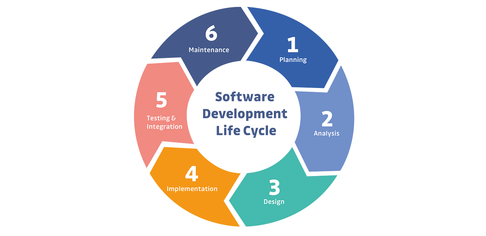

# Software-Development-Life-Cycle

    **SDLC** stands for **Software Development Life Cycle**.

It is a **step-by-step process** that is followed to **develop high-quality software** in a structured and efficient way.

---

### 🔁 **Main Steps in SDLC 

1. **Requirement Gathering**
   ➤ The needs of the users are collected.
   ➤ What the software should do is clearly understood.

2. **Analysis**
   ➤ The gathered requirements are studied.
   ➤ Technical and financial feasibility is checked.

3. **Design**
   ➤ A blueprint of how the software will look and work is created.
   ➤ This includes architecture, UI design, database design, etc.

4. **Development (Coding)**
   ➤ Actual coding is done here.
   ➤ Developers write code to create the system.

5. **Testing**
   ➤ The software is tested to find and fix errors.
   ➤ It ensures that the software works as expected.

6. **Deployment**
   ➤ The final product is installed on users' systems.
   ➤ It is made live for actual use.

7. **Maintenance**
   ➤ Regular updates and bug fixes are done.
   ➤ New features can be added if needed.

---------------------------------

###  Purpose of SDLC

* To ensure software is built **on time**, **within budget**, and **with expected quality**.

---

### Here is a picture that depicts all the stages in SDLC

---
### EXAMPLE[Scenario Based Explination]

To build a food delivery app, the first step is requirement gathering, where features like ordering food, tracking delivery, and online payments are discussed. Next is analysis, where the team checks if the app can support many users and payment systems within the budget. In the design phase, the layout of the app, screens, and database are planned. Then, during development, the actual coding is done to build features like login, menu display, and order placement. After that, in the testing phase, the app is checked for bugs, such as payment errors or crashes. Once tested, it's deployed to the app stores for users. Finally, in the maintenance phase, updates and bug fixes are done regularly, and new features like promo codes may be added.

    *** Requrement Gathering -> Analysis -> Design -> Development -> Testing -> Deployment -> Maintenance -> ***
the cycle itself repeats